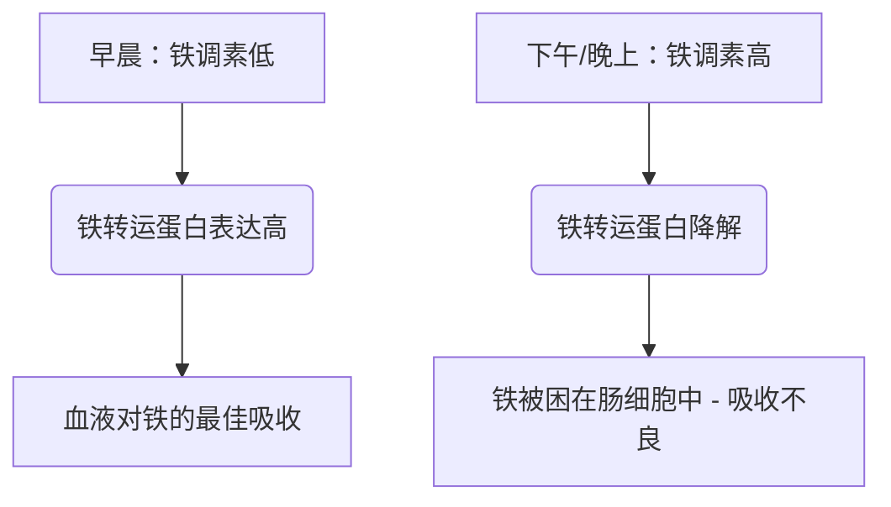

铁是一种不可或缺的微量营养素，在氧气运输、细胞呼吸和 DNA 合成中作为结构和催化辅因子发挥作用。尽管它在自然界中含量丰富，但铁常常是人类饮食中限制生长的营养素。由于人类没有主动排泄铁的生理机制，全身的铁平衡完全在肠道吸收的层面上维持。

饮食中的铁主要有两种形式：**有机（血红素）铁**和**无机（非血红素）铁**。

血红素铁具有极高的生物利用度，通常的吸收率在 15% 到 35% 之间。它通过血红素载体蛋白 1 (HCP1) 完整地转运穿过十二指肠肠上皮细胞的顶端刷状缘，并且不受标准饮食抑制剂的影响。

相反，非血红素铁（无机铁）占饮食摄入量的 80% 以上，但其吸收状况却大打折扣，吸收率仅在 2% 到 20% 之间。

> [!TIP]
> 在生理 pH 值下，非血红素铁主要以氧化的高不溶性高铁 (Fe³⁺) 状态存在。为了被吸收，它必须在通过二价金属转运蛋白 1 (DMT1) 进入肠上皮细胞之前，被顶端还原酶十二指肠细胞色素 b (Dcytb) 还原为可溶性的亚铁 (Fe²⁺) 状态。

## 血红素铁 vs 非血红素铁途径

| 特征 / 指标 | 血红素铁途径 | 非血红素（无机）铁途径 |
| :--- | :--- | :--- |
| **饮食来源** | 动物组织（血红蛋白、肌红蛋白） | 植物、强化铁食品、矿物盐 |
| **顶端转运蛋白** | 血红素载体蛋白 1 (HCP1) | 二价金属转运蛋白 1 (DMT1) |
| **所需价态** | 卟啉结合络合物 | 亚铁 (Fe²⁺) |
| **最佳肠道 pH 值** | 广泛稳定；不受胃酸影响 | 需要高酸性 (pH < 3.0) 才能溶解 |
| **典型吸收效率**| 15% – 35%（高生物利用度） | 2% – 20%（波动很大） |
| **对饮食抑制剂的敏感性** | 微乎其微；受卟啉环保护 | 极高（受植酸盐、多酚、钙抑制） |

## 最佳服用时间（时间药理学）

优化非血红素铁的吸收需要与**铁调素 (Hepcidin)** 的昼夜节律精确协调。铁调素主要由肝细胞合成，是一种含有 25 个氨基酸的肽类激素。铁调素作为全身铁稳态的主要调节剂，通过直接结合基底外侧的铁转运蛋白 (Ferroportin) 并诱导其降解来发挥作用。因此，循环中铁调素水平的升高会将铁困在十二指肠肠上皮细胞内，阻止其进入血液。

### 铁调素的昼夜节律
在基础生理条件下，铁调素浓度在清晨处于最低点，在整个下午稳步上升至峰值，并在夜间下降。

这种昼夜节律曲线直接影响口服铁剂的动力学。**早晨服用**铁剂补充剂可以使矿物质在肠上皮细胞铁转运蛋白表达最高时到达十二指肠。相反，在下午或晚上服用会迫使铁与升高的铁调素阻断作用相竞争，导致部分铁吸收率降低 37%。

### 胃酸的影响
无机铁的生物物理状态高度依赖于胃酸的产生。通过质子泵抑制剂（PPI - 胃药）进行药理学上的胃酸抑制会严重破坏这种微环境，提高胃液 pH 值，并导致可溶性的 Fe²⁺ 迅速氧化为高度不溶性的 Fe³⁺。

> [!WARNING]
> 口服铁剂必须空腹服用（最好在饭前 1 小时或饭后 2 小时），并且必须严格与任何抑制胃酸的药物分开服用。

## 致命的相互作用（绝对不能混合的物质）

如果在摄入口服铁剂的同时摄入各种饮食化合物和药物，其治疗效果极易受损。

### 钙
无论作为膳食奶制品（牛奶、奶酪、酸奶）还是作为矿物质补充剂（碳酸钙）摄入，钙都是血红素和非血红素铁吸收的强效抑制剂。在含铁的膳食中同时摄入 500 毫克碳酸钙会使部分铁的吸收减少 50% 以上。

### 单宁和多酚
在**红茶、绿茶、花草茶和咖啡**中发现的多酚是非常有效的铁螯合剂。这些植物源性化合物与高铁配位，形成高度稳定的大型有机金属络合物，这些络合物无法穿过十二指肠刷状缘。在膳食中仅添加一杯咖啡或茶就能使非血红素铁的吸收减少 40% 到 70%。

### 植酸
植酸是全谷物、谷类、坚果和豆类中主要的磷储存化合物。植酸与铁的摩尔比是限制植物性饮食中铁生物利用度的最重要的单一饮食因素。

### 锌和镁
亚铁、锌和镁在穿过肠上皮细胞顶端膜（例如 DMT1）时共享重叠的转运途径。在治疗性铁剂量下，会发生竞争性抑制，从而显着抑制铁的转运。请勿将您的铁剂与锌或镁同时服用。

### 甲状腺药物（左甲状腺素）
将口服铁剂与左甲状腺素（甲状腺激素）同时服用会导致严重的药物-营养素相互作用。铁与左甲状腺素分子配位，形成不溶性络合物，使左甲状腺素的口服生物利用度降低 20% 到 64%。

> [!CAUTION]
> 为了防止甲状腺治疗失败，左甲状腺素和铁剂的使用之间必须严格保持至少 4 小时的间隔。

## 终极辅因子：维生素C

抗坏血酸（维生素C）是非血红素铁吸收的最强促进剂，能够消除膳食植酸盐、多酚和钙的抑制作用。

这种协同关系通过高效的双重生化机制发挥作用：
1. **热力学上有利的还原：** 抗坏血酸将不溶性高铁离子 (Fe³⁺) 快速转化为高度可溶的亚铁 (Fe²⁺) 形式，为转运做好准备。
2. **十二指肠螯合：** 抗坏血酸充当保护盾，防止铁在过渡到十二指肠的碱性环境时与植酸盐和多酚结合。

## 副作用与“隔日服用”范式

治疗缺铁性贫血的传统方法（每天开大剂量的口服铁剂）由于严重的胃肠道副作用（恶心、便秘）和全身性反馈循环而经常失败。

由于部分吸收率低，标准口服铁剂剂量的高达 90% 会未被吸收地留在胃肠道中。这些多余的铁与过氧化氢反应生成剧毒的羟基自由基，引发氧化应激和粘膜炎症。

此外，每天高剂量的铁剂补充会引发全身性的**“粘膜阻滞 (Mucosal Block)”**。摄入 ≥ 60 毫克的口服铁剂会引起血清铁调素迅速激增，并在 24 小时内保持较高水平。如果在第二天服用第二剂铁剂，肠上皮细胞会被物理阻断，无法将其输出到门静脉循环中。铁被困住，最终被排泄掉。

> [!TIP]
> **隔日服用：** 为了绕过这种由铁调素介导的阻滞，现代血液学已转向**隔天（每两天一次）**口服铁剂。临床试验证明，每 48 小时服用一次铁剂，其部分铁吸收率比连续每天服用高出 40% 到 50%，同时大大减少了胃肠道副作用。

### 临床方案总结

*   **低胃内 pH 值必不可少：** 铁剂应空腹用白水送服。
*   **避免主要的饮食抑制剂：** 严格避免将铁剂与钙、奶制品、咖啡或茶同时服用。
*   **保持严格的药物间隔：** 铁剂和左甲状腺素至少间隔 4 小时。
*   **利用维生素 C：** 将铁剂与维生素 C 一起服用可将吸收率提高多达 300%。
*   **采用隔日服用法：** 每隔 48 小时服用口服铁剂，以避免铁调素引起的粘膜阻滞并最大化吸收。

## 参考文献

1. Stoffel NU, Zeder C, Brittenham GM, Moretti D, Zimmermann MB. [Iron absorption from oral iron supplements given on consecutive versus alternate days and as single morning doses versus twice-daily split dosing in iron-depleted women: two open-label, randomised controlled trials](https://pubmed.ncbi.nlm.nih.gov/29032957/). *Lancet Haematol.* 2017.
2. Campbell NR, Hasinoff BB. [Ferrous sulfate reduces thyroxine efficacy in patients with hypothyroidism](https://pubmed.ncbi.nlm.nih.gov/1443969/). *Ann Intern Med.* 1992.
3. Hallberg L, Hulthén L. [Effect of ascorbic acid intake on nonheme-iron absorption from a complete diet](https://pubmed.ncbi.nlm.nih.gov/11124756/). *Am J Clin Nutr.* 2000.
4. Lönnerdal B. [Calcium and iron absorption—mechanisms and public health relevance](https://pubmed.ncbi.nlm.nih.gov/21462112/). *Int J Vitam Nutr Res.* 2010.

本文仅供参考，不构成医疗建议。在改变您的补充剂或药物使用方案之前，请咨询合格的医疗专业人员。
