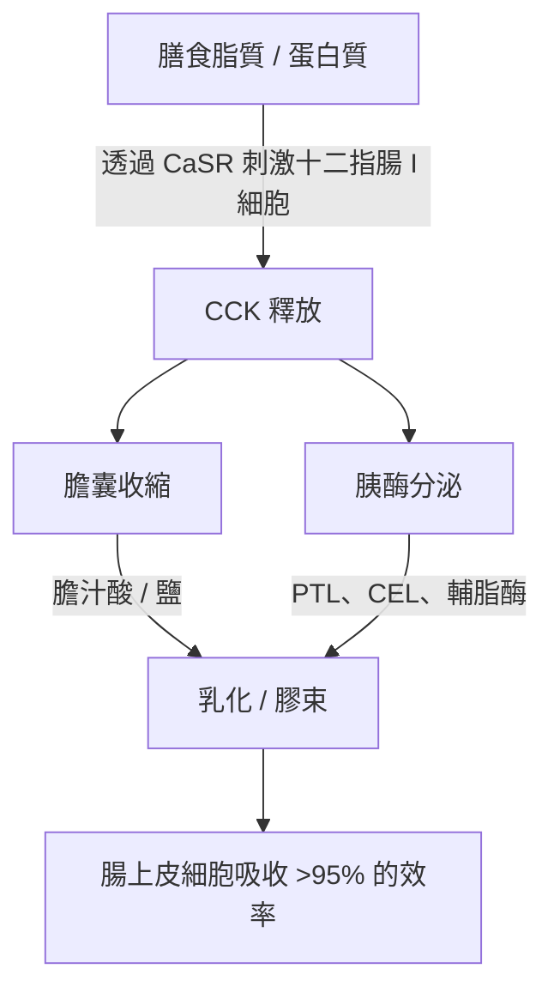
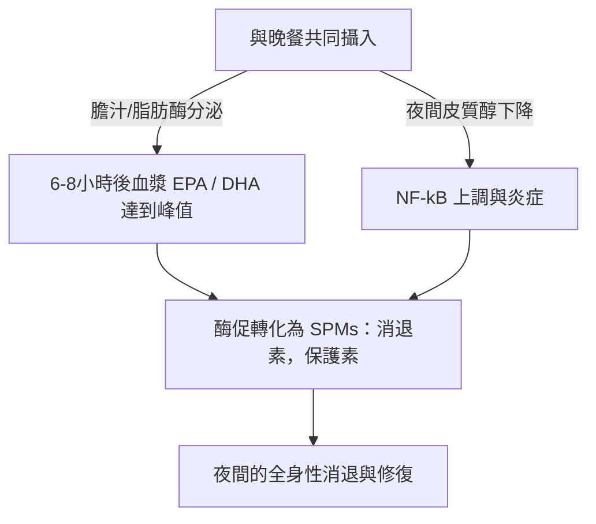

長鏈海洋 Omega-3 多不飽和脂肪酸（$\text{PUFA}$），特別是二十碳五烯酸（$\text{EPA}$）和二十二碳六烯酸（$\text{DHA}$）的治療功效，嚴格取決於它們的腸道生物利用度。在臨床營養學中，治療失敗的一個主要原因是「低脂飲食悖論（lean-meal paradox）」——在空腹狀態下或與無脂飲食一起服用高度疏水性的海洋脂質。儘管服用了高標稱劑量的補充劑，但缺乏結構化的脂質共攝入基質，阻礙了在人體胃腸道水性管腔中吸收脂質所需的物理和酶促機制。本臨床分析詳細介紹了決定 $\text{EPA}$ 和 $\text{DHA}$ 消化和吸收的生物物理、生化和時間藥理學原理。

## 禁食與低脂飲食悖論

胃腸道從根本上說是一個水性（基於水）的系統。當攝入如標準魚油等疏水性（斥水性）脂質時，它們會遇到極性極強的胃液和腸液環境。根據熱力學定律，疏水性分子會最大限度地減少與水的接觸，導致快速的相分離。這會導致攝入的油脂聚集成大的、未分割的脂質小球，漂浮在水性食糜的頂部。

空腹時用一杯水吞服 Omega-3 膠囊，或與純碳水化合物飲食（如一片水果或一片乾麵包）一起服用，無法觸發克服這種相分離所需的生理過程。如果沒有物理乳化，脂質相的表面積與體積比將保持極低。胰脂肪酶的親水性活性位點無法接觸到埋藏在這些巨大疏水性液滴內部的酯鍵。因此，用水送服魚油並不能促進吸收；相反，它會稀釋空腹狀態下存在的微量消化酶，使未乳化的脂質小球進一步遠離腸上皮細胞的刷狀緣膜，導致吸收不良和胃腸道不適。

為了使這些高度疏水性的脂質穿過腸粘膜的非攪拌水層（unstirred water layer），它們必須轉化為熱力學穩定、可分散在水中的相。這種轉化完全依賴於膠束化（micellarization）的物理化學過程，這是一個由激素介導的十二指腸信號傳導啟動的過程。

## 膽汁鹽與膠束形成

從漂浮的疏水性油塊轉變為可吸收的微滴，需要在十二指腸內進行協調的分泌和神經肌肉級聯反應。這一過程的主要激素驅動因素是膽囊收縮素（$\text{CCK}$），這是一種由十二指腸和空腸上部粘膜內層的腸內分泌 I 細胞合成和分泌的 33 氨基酸肽。



在生理條件下，十二指腸管腔內長鏈脂肪酸和部分消化蛋白質的存在會刺激 I 細胞上的鈣敏感受體（$\text{CaSR}$），引發 $\text{CCK}$ 快速胞吐進入血液。一旦釋放，$\text{CCK}$ 就會與膽囊壁上的 $\text{CCK}_A$ 受體結合，導致膽囊收縮，同時放鬆奧迪括約肌（Sphincter of Oddi），並刺激胰腺腺泡細胞釋放消化酶。

膽囊釋放的膽汁酸——主要是膽酸和鵝脫氧膽酸的兩親性鈉鹽——是必不可少的生物清潔劑（表面活性劑）。當十二指腸中的膽汁酸濃度超過臨界膠束濃度（$\text{CMC}$）時，它們會圍繞在疏水性脂質液滴周圍。膽汁鹽的疏水性類固醇核心與脂質相結合，而極性、親水性的結合基團（甘氨酸或牛磺酸）則朝向水性十二指腸管腔。

透過腸道蠕動的機械作用，這些包裹著膽汁的液滴被剪切成混合膠束。這些球形膠體聚集體的直徑僅為 3 到 10 奈米，使暴露於胰脂肪酶的脂質表面積增加了數千倍。如果沒有同時攝入健康的膳食脂肪（如特級初榨橄欖油、酪梨或散養蛋黃）來觸發 $\text{CCK}$ 釋放的閾值，就不會發生膽囊收縮。在這種狀態下，膽汁酸水平保持在 $\text{CMC}$ 以下，胰脂肪酶分泌極少，攝入的 Omega-3 脂質無法形成膠束，從而阻礙了吸收。

## 生化形式之爭：TG vs. EE vs. PL

市售的 Omega-3 補充劑主要以三種分子形式存在：天然或甘油三酯再酯化（$\text{TG}$/$\text{rTG}$）、乙酯（$\text{EE}$）和磷脂（$\text{PL}$）。這些載體的分子結構決定了它們的消化速度、對脂肪酶的依賴性以及生物利用度。

```text
甘油三酯 (TG) 形式：               乙酯 (EE) 形式：                磷脂 (PL) 形式：
     ┌─ 甘油骨架                        ┌─ 乙醇分子                     ┌─ 磷酸鹽頭部 (極性)
     ├─ 脂肪酸 (EPA)                    └─ 脂肪酸 (EPA)                 ├─ 脂肪酸 (EPA)
     ├─ 脂肪酸 (DHA)                                                    └─ 脂肪酸 (DHA)
     └─ 脂肪酸 (其他)
```

在天然和再酯化的甘油三酯（$\text{TG}$/$\text{rTG}$）中，三個脂肪酸（$\text{EPA}$/$\text{DHA}$）結合在一個三碳甘油骨架上。在消化過程中，胰甘油三酯脂肪酶（$\text{PTL}$）與其輔助因子輔脂酶協同作用，水解 $sn\text{-}1$ 和 $sn\text{-}3$ 位置的酯鍵。這會產生兩個游離脂肪酸和一個 $sn\text{-}2$-甘油一酯，它們都具有高極性，容易膠束化，並且很容易被腸上皮細胞吸收，效率超過 95%。

相反，乙酯（$\text{EE}$）形式是在化學濃縮過程中產生的合成產物。甘油骨架被移除，每個單獨的脂肪酸被酯化到一個乙醇分子（$\text{CH}_3\text{CH}_2\text{OH}$）上。這種合成酯鍵對人類胰酶具有高度的抗性。體外和體內研究表明，人類胰脂肪酶水解 $\text{EE}$ 中脂肪酸-乙醇鍵的速度比水解甘油三酯中甘油酯鍵的速度慢 10 到 50 倍。

由於水解緩慢，$\text{EE}$ 的吸收高度依賴於胰脂肪酶和膽汁鹽的大量釋放，而這只有高脂飲食才能引發。當與低脂飲食一起服用時，有限的可用胰脂肪酶無法有效裂解 $\text{EE}$ 鍵，導致生物利用度差（通常降至約 20%），並導致未吸收的合成酯進入結腸，在那裡它們會引起胃腸道副作用。

磷脂（$\text{PL}$）形式主要來源於南極磷蝦油（Euphausia superba），具有兩親性結構，其中 $\text{EPA}$ 和 $\text{DHA}$ 結合在磷脂酰膽鹼骨架上。高極性的磷酸鹽頭部基團使磷脂自然地可分散在水中。正因為如此，$\text{PL}$ 形式可以在胃腸道中自乳化（self-emulsifying）並自發形成微滴，從而繞過了膽汁鹽刺激膠束化的絕對要求。磷脂也透過磷脂酶 $\text{A}_2$ 消化，並且可以直接作為溶血磷脂被腸上皮細胞吸收，即使在禁食或低脂條件下也能實現高生物利用度。

| 生化形式 | 分子載體 / 骨架 | 平均吸收率（低脂飲食） | 平均吸收率（高脂飲食） | 相對生物利用度（以 EE 為基準） | 胰脂肪酶依賴性 |
| --- | --- | --- | --- | --- | --- |
| 乙酯 (EE) | 乙醇 ($\text{CH}_3\text{CH}_2\text{OH}$) | $\approx 20\%$ | $\approx 60\%$ | 基準線 ($100\%$) | 絕對依賴；水解速度比 TG 慢 10-50 倍 |
| 甘油三酯 (TG / rTG) | 甘油骨架 | $\approx 68\%$ | $\approx 90\%$ | $124\%$ 至 $186\%$ | 高；迅速裂解為 2-FFA 和 1-MAG |
| 磷脂 (PL) | 磷脂酰膽鹼 | $\approx 80\%$ 至 $95\%$ | $>95\%$ | $168\%$ 至 $500\%$ | 極低；自乳化，繞過部分脂肪酶 |

> [!WARNING]
> 患有外分泌胰腺功能不全（EPI）、膽道運動功能障礙或膽囊切除術後的個體，其內源性脂質消化功能嚴重受損。對於這些臨床人群，在低脂飲食限制下服用合成乙酯（EE）製劑，存在完全吸收不良和胃腸道不適的高風險，因為在這些狀態下幾乎不存在必要的酶促裂解。

## 脂質氧化與維生素 E 的絕對必要性

使 $\text{EPA}$ 和 $\text{DHA}$ 具有生物活性的結構特徵，也使它們變得極不穩定。$\text{EPA}$ 含有五個，$\text{DHA}$ 含有六個被亞甲基中斷的雙鍵。雙烯丙基亞甲基碳（$\text{-CH=CH-CH}_2\text{-CH=CH-}$）上的碳-氫鍵具有較低的鍵解離能。這使得它們極易受到自由基攻擊和非酶促脂質過氧化作用的影響。

```text
階段 1：引發（Initiation）
  [PUFA 碳-氫鍵] + [ROS / 自由基] ──> [以碳為中心的脂質自由基 (R•)]

階段 2：增殖（Propagation）
  [以碳為中心的脂質自由基 (R•)] + [O2] ──> [脂質過氧自由基 (ROO•)]
  [脂質過氧自由基 (ROO•)] + [未氧化的 PUFA] ──> [脂質氫過氧化物 (ROOH)] + [新的脂質自由基 (R•)]

階段 3：分解（Decomposition）
  [不穩定的脂質氫過氧化物 (ROOH)] ──> [有毒醛類 (MDA / HHE)]
```

魚油一旦被攝入，就會暴露在 $37^\circ\text{C}$（體溫）、胃酸和溶解的分子氧（$\text{O}_2$）環境中。這種環境會透過三個不同的階段加速脂質過氧化級聯反應：

1. **引發：** 活性氧（$\text{ROS}$）從雙烯丙基碳中提取一個氫原子，產生一個以碳為中心的脂質自由基（$\text{R}^\bullet$）。
2. **增殖：** 脂質自由基與分子氧（$\text{O}_2$）迅速反應，形成脂質過氧自由基（$\text{ROO}^\bullet$）。然後，該過氧自由基從相鄰的未氧化 $\text{PUFA}$ 分子中提取一個氫原子，產生脂質氫過氧化物（$\text{ROOH}$）和新的脂質自由基，從而使鏈式反應持續進行。
3. **分解：** 不穩定的脂質氫過氧化物分解成高反應性、具有細胞毒性的二次氧化產物，包括丙二醛（$\text{MDA}$）和 4-羥基壬烯醛（$\text{HHE}$）等烯醛。

這些二次氧化產物很容易透過腸道被吸收，摻入乳糜微粒和低密度脂蛋白（$\text{LDL}$）中，並可能誘發全身性氧化應激、內皮損傷和動脈粥樣硬化。

為了阻止這一過程，補充劑配方中必須加入一種能阻斷鏈式反應的脂溶性抗氧化劑。天然維生素 E，特別是 d-α-生育酚（$\text{C}_{29}\text{H}_{50}\text{O}_2$），非常適合這一角色。d-α-生育酚作為氫供體，以大約 $10^6\,\text{M}^{-1}\text{s}^{-1}$ 的極快反應速率常數，將其酚氫原子快速轉移給具有反應性的脂質過氧自由基（$\text{ROO}^\bullet$）。

由於未成對電子在苯並二氫吡喃環（chromanol ring）上發生共振離域，由此產生的生育酚自由基非常穩定，從而防止它攻擊相鄰的脂肪酸鏈。這阻斷了鏈式反應，保護了 $\text{EPA}$ 和 $\text{DHA}$ 分子的結構完整性，使其能夠以具有活性的、未氧化的狀態到達目標組織。

## 時間藥理學與夜間抗炎窗口

在脂質生物化學中，時機（timing）是一個關鍵因素。在一天中攝入量最大、脂質密度最高的一餐（通常是晚餐）中攝入 Omega-3 補充劑，可以同時優化吸收率和身體自然的夜間癒合過程。



首先，從歷史上看，晚餐對許多人來說是一天中脂肪含量最高的一餐。這提供了觸發最大 $\text{CCK}$ 釋放所需的物理脂質體積，從而導致強烈的膽囊收縮、豐富的膽汁分泌和高胰脂肪酶活性。這優化了膠束化和消化動力學，確保幾乎所有攝入的劑量都能成功被吸收。

其次，在晚上服用與人體的晝夜免疫和炎症週期相吻合。在傍晚和夜間，內源性皮質醇水平自然下降至每天的最低水平。皮質醇是一種強效的抗炎激素；當它的水平下降時，全身性炎症途徑——例如由促炎轉錄因子 $\text{NF}\text{-}\kappa\text{B}$ 控制的炎症途徑——會經歷相對的「上調」（upregulation）。

在晚餐時攝入 Omega-3，$\text{EPA}$ 和 $\text{DHA}$ 的血漿和細胞膜濃度會在 6 到 8 小時後達到峰值，這正好與這個夜間炎症窗口相吻合。在這一階段，身體將這些脂肪酸作為底物，透過環氧合酶（$\text{COX}$）和脂氧合酶（$\text{LOX}$）途徑，進行特異性促炎症消退介質（$\text{SPMs}$）——特別是消退素（resolvins）、保護素（protectins）和巨噬細胞炎症消退素（maresins）——的酶促合成。這些 $\text{SPMs}$ 積極消退慢性微炎症，促進細胞更新，並在睡眠期間支持組織癒合。

此外，在晚上服用 Omega-3（特別是 $\text{DHA}$）能提供獨特的神經學益處。$\text{DHA}$ 是神經元細胞膜中的關鍵結構脂質，在大腦的生物鐘中起著重要作用。它作用於負責調節睡眠-覺醒週期的生物鐘基因（如 BMAL1 和 CLOCK）。

在夜間，$\text{DHA}$ 融入突觸膜可以支持神經元通訊，增強血清素的合成，並優化其向褪黑激素的轉化。臨床試驗表明，持續的夜間 Omega-3 補充能顯著改善睡眠效率，縮短入睡潛伏期，並降低睡眠片段化指數（夜間醒來的次數）。

> [!TIP]
> 為了最大化長鏈 Omega-3 脂肪酸的細胞生物摻入率，臨床醫生應建議患者在每天脂質最豐富的一餐中服用每日劑量。與至少 10-15 克的健康單不飽和或多不飽和脂肪（例如，特級初榨橄欖油或酪梨）一起攝入，就足以觸發最佳膠束化所需的膽囊收縮素釋放閾值。

## 臨床綜合與可行性建議

最大化 Omega-3 補充劑的治療潛力需要改變觀念，不能僅僅吞下高標稱劑量的膠囊，而應轉向基於脂質生物化學和消化動力學的方法。空腹用水送服魚油的傳統做法通常會導致吸收不良和胃腸道副作用。

為了獲得最佳的治療效果，臨床醫生應優先考慮再酯化甘油三酯（$\text{rTG}$）或磷脂（$\text{PL}$）配方，與合成乙酯（$\text{EE}$）相比，它們顯示出優越的吸收動力學，並且對高脂飲食的依賴性更低。

無論選擇哪種配方，補充劑都必須與含有至少 10 到 15 克膳食脂肪的一餐一起服用。這個脂質閾值對於觸發十二指腸 $\text{CCK}$ 信號級聯反應是必需的，它啟動膽囊收縮和胰脂肪酶分泌，以實現完全的膠束化。

此外，為了保護這些高度不穩定的 $\text{PUFA}$ 在體內免受氧化損傷，補充劑配方必須始終包含天然的脂溶性抗氧化劑，如 d-α-生育酚（維生素 E）。

最後，將補充時間與晚餐對齊可確保吸收峰值與身體自然的夜間抗炎和細胞修復途徑相吻合，從而最大限度地發揮 $\text{EPA}$ 和 $\text{DHA}$ 在心血管、免疫和神經學方面的益處。

## 參考文獻

1. Nordøy A, et al. [Absorption of the n-3 eicosapentaenoic and docosahexaenoic acids as ethyl esters and triglycerides by humans](https://pubmed.ncbi.nlm.nih.gov/1826985/). *American Journal of Clinical Nutrition.* 1991.
2. Offman E, Marenco T, Ferber S, Johnson J, Kling D, Curcio D, Davidson M. [Steady-state bioavailability of prescription omega-3 on a low-fat diet is significantly improved with a free fatty acid formulation compared with an ethyl ester formulation: the ECLIPSE II study](https://pubmed.ncbi.nlm.nih.gov/24124374/). *Vascular Health and Risk Management.* 2013.
3. Schuchardt JP, Schneider I, Meyer H, Neubronner J, von Schacky C, Hahn A. [Incorporation of EPA and DHA into plasma phospholipids in response to different omega-3 fatty acid formulations - a comparative bioavailability study of fish oil vs. krill oil](https://pubmed.ncbi.nlm.nih.gov/21854650/). *Lipids in Health and Disease.* 2011.
4. Brown JE, Wahle KW. [Effect of fish-oil and vitamin E supplementation on lipid peroxidation and whole-blood aggregation in man](https://pubmed.ncbi.nlm.nih.gov/2282693/). *Clinica Chimica Acta.* 1990.

本文僅供資訊參考，不構成醫療建議。在調整您的補充劑或藥物治療方案之前，請諮詢合格的醫療專業人員。
