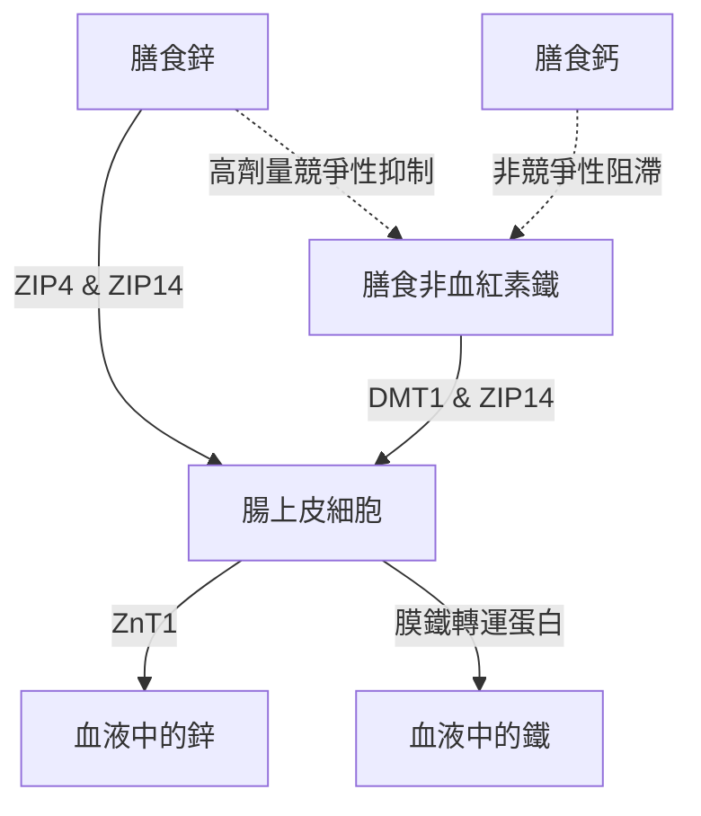

口服鋅（$\text{Zn}^{2+}$）補充劑存在一系列生理和生化上的悖論。雖然鋅是參與300多種酶反應的重要微量礦物質，但其口服攝入經常會受到急性胃腸道不適、與其他二價陽離子的競爭性抑制以及全身性礦物質消耗的阻礙。解決這些問題需要深入了解腸道轉運蛋白動力學、黏膜生化學和時間藥理學，從而設計出最佳的服用方案。

## 空腹悖論：黏膜刺激 vs 生物利用度

口服鋅補充劑面臨著一個艱難的抉擇：空腹服用可使細胞生物利用度最大化，但往往會引起急性的胃腸道不適（噁心）。相反，與食物一起服用可成功緩解不適，但會引入飲食中的拮抗劑（抑制劑），從而嚴重降低鋅的吸收率。

### 胃刺激與噁心的分子機制
攝入高水溶性的無機鋅鹽——如硫酸鋅（$\text{ZnSO}_4$）或氯化鋅（$\text{ZnCl}_2$）——會導致其在胃腔內迅速溶解。在水溶液中，這些鹽完全解離，產生一個高濃度且呈酸性的局部環境，pH值約為4.0至5.0。

在禁食狀態下，由於沒有食物團，胃黏膜處於缺乏緩衝的狀態。突然暴露於游離的二價鋅離子（$\text{Zn}^{2+}$）會對胃上皮細胞產生直接的腐蝕和刺激作用。這種局部刺激會促使胃壁細胞過量分泌鹽酸（HCl），進一步降低胃的pH值，並可能引發黏膜糜爛。

這種化學和酸性刺激會被遍布胃壁的迷走神經感覺神經元網絡所感知。一旦被激活，這些神經元就會通過迷走神經將動作電位傳遞到腦幹。這會引發由中樞介導的嘔吐反射，表現在攝入後30分鐘內出現立即的噁心、胃排空延遲和胃痙攣。

### 吸收阻滯：植酸、穀物與乳製品

當鋅與食物一起服用以防止迷走神經刺激（噁心）時，其生物利用度會受到飲食抑制劑的嚴重損害。這些抑制劑中最強的是**植酸**，它高度濃縮在未精製穀物、豆類、堅果和種子的外殼中。

在十二指腸的生理pH值下，植酸充當一種侵略性的配體，螯合（捕獲）游離的 $\text{Zn}^{2+}$ 離子，形成高度穩定、不溶且結構複雜的沉澱物，這些沉澱物完全無法被腸道吸收。由於人類上消化道缺乏內源性的植酸酶，這些鋅-植酸複合物保持不被水解的狀態，並隨糞便排出體外。

> [!CAUTION]
> 使用放射性標記物的定量研究表明，僅在膳食中添加 50 毫克植酸，鋅的吸收率就會減少約 36%（從 22% 降至 14%）。而 250 毫克的植酸濃度則會將吸收率完全壓制到可忽略的 6-7%。

此外，乳製品也具有獨立的抑制作用。**酪蛋白**（牛奶中的主要蛋白質片段）會在腸腔內結合鋅離子，與乳清蛋白相比，其會顯著降低鋅的生物利用度。

### 鋅化合物的形態與耐受性

| 化學類別 | 鋅化合物形態 | 估計吸收率 | 胃腸耐受性 | 作用機制 |
| :--- | :--- | :--- | :--- | :--- |
| **無機鹽** | 硫酸鋅（$\text{ZnSO}_4$） | ~20–49.9% | 高度刺激（~15%噁心） | 迅速解離為游離的 $\text{Zn}^{2+}$；酸性pH。 |
| **有機鹽** | 葡萄糖酸鋅 | ~50.6–71.7% | 中度耐受（~5%噁心） | 中性pH；緩慢解離，刺激性較小。 |
| **有機螯合物**| 甘氨酸鋅 | ~50–60% | 極高耐受度（<5%噁心） | 與甘氨酸結合；抵抗胃酸解離和植酸干擾。 |

### 科學的最佳服用方案

要完全避開空腹時的噁心反射和植酸的吸收阻滯，必須採用特定的臨床方案：

1. **轉向有機螯合物：** 應使用 pH 中性的有機金屬-氨基酸螯合物（如甘氨酸鋅）來替代無機鋅鹽。在甘氨酸鋅中，$\text{Zn}^{2+}$ 離子與兩個甘氨酸配體共價結合，保護礦物質免受胃酸的過早解離。
2. **利用低拮抗劑的緩衝食物：** 如果患者極其敏感，需要食物緩衝以防止噁心，鋅應僅與完全不含植酸和高劑量鈣的清淡零食一起服用。允許的食物包括白酸麵團麵包（發酵過程分解了植酸）或簡單的動物蛋白（雞蛋或分離乳清蛋白）。

> [!TIP]
> **專家提示：** 為了在完全避免噁心的同時最大化吸收，理想的方案是在下午早些時候將 15-30 毫克的元素甘氨酸鋅與不含植酸的清淡零食一起服用，並確保攝入前後有兩小時的空腹時間（包括咖啡和茶）。

## 轉運蛋白之戰：DMT1 與 ZIP14

小腸的腸上皮細胞是二價金屬吸收競爭極其激烈的場所。鋅（$\text{Zn}^{2+}$）、非血紅素鐵（$\text{Fe}^{2+}$）和鈣（$\text{Ca}^{2+}$）共享重疊且可飽和的轉運路徑。這意味著高劑量補充劑的共同給藥會直接抑制彼此的吸收。

### 轉運蛋白格局：ZIP4、ZIP14 和 DMT1
在十二指腸腸上皮細胞的頂端膜上，膳食鋅的主要進口通道是 ZIP4。非血紅素鐵（植物/無機鐵）則依賴於另一條路徑：DMT1。然而，還有另一種關鍵的轉運蛋白 ZIP14；雖然它被歸類為鋅轉運蛋白，但它同樣具有高度運輸鐵（$\text{Fe}^{2+}$）的能力。

由於 $\text{Zn}^{2+}$ 和 $\text{Fe}^{2+}$ 在電荷和離子半徑上非常相似，它們會激烈競爭共享的細胞內轉運路徑（如 ZIP14）。當治療劑量（高劑量）的鐵（100-400毫克）與鋅同時給藥時，鐵在細胞攝取上會戰勝鋅。臨床研究表明，同時服用高劑量鐵和標準的 25 毫克鋅會將鋅的吸收率降低約 40-50%。

## 銅耗竭的危險：細胞內的困境

長期服用高劑量鋅補充劑的一個重大危險是全身性銅缺乏症的隱匿發展。這一路徑是由腸上皮細胞內一種結合金屬的蛋白質——**金屬硫蛋白**的向上調節所介導的。

當個體長期攝入高劑量的鋅（通常超過40-50毫克/天）時，大量細胞內 $\text{Zn}^{2+}$ 的湧入會作為一個強烈的信號，引發金屬硫蛋白的大規模合成。儘管其合成很大程度上是由鋅水平驅動的，但該蛋白質對銅（$\text{Cu}^+$）的結合親和力大大高於其對鋅的親和力。

因此，當膳食中的銅被吸收到腸上皮細胞時，大量存在的金屬硫蛋白分子會迅速結合並封存銅離子。這些銅被困在極其穩定的複合物中，無法進入血液。由於腸道細胞每3至5天就會脫落更新，困在其中的銅便隨糞便排出。隨著時間的推移，這種阻滯會導致嚴重的系統性銅耗竭。

> [!WARNING]
> 連續四周以上每天服用超過 40 毫克的鋅，而沒有按照 15:1 的比例進行相應的銅平衡，就有引發嚴重銅缺乏症的風險。這可能導致脫髮、不可逆的神經損傷和貧血。

### 臨床安全的鋅銅比例
在長期補充期間，為了完全防止金屬硫蛋白引起的銅困境，任何鋅補充劑都必須以高度特定的治療比例與銅配對。臨床上確定的安全且具有協同作用的**鋅銅比例為 8:1 至 15:1**。每 15 毫克鋅攝入 1 毫克銅可完全消除此危險。

## 鋅的時間藥理學：晝夜節律與睡眠

營養素的給藥時間是決定其功效的主要因素。鋅是合成褪黑素（睡眠激素）所需的基礎生化輔因子。鋅缺乏會直接下調 AANAT（控制褪黑素產生的酶）的轉錄，導致夜間褪黑素大幅下降（失眠）。

此外，鋅在中樞神經系統中作為一種直接的神經調節劑。在神經興奮時，鋅充當興奮性 NMDA 穀氨酸受體的強效拮抗劑（阻斷劑），同時增強具有鎮靜作用的 GABA 受體。這種雙重作用——抑制興奮的同時增強放鬆——有助於平穩過渡到深度的慢波睡眠。

### SuppTime 優化的服用方案

| 時間段 | 補充劑組合 | 時間生物學依據 |
| :--- | :--- | :--- |
| **早晨** | 益生菌 | 剛醒來時胃酸量較低，可最大化細菌在胃酸中的存活率。 |
| **早餐** | 非血紅素鐵、維生素C、維生素D3 | 維生素C促進鐵吸收。請避開鈣和鋅。 |
| **午餐 / 下午** | 甘氨酸鋅 (15–30 毫克) + 銅 (1–2 毫克) | 以 15:1 的比例配製以防止銅耗竭；與鐵和鈣完全分開。 |
| **夜晚** | 鈣、甘氨酸鎂 | 鎂在睡前放鬆骨骼肌肉系統並調節具有鎮靜作用的 GABA 受體。 |
