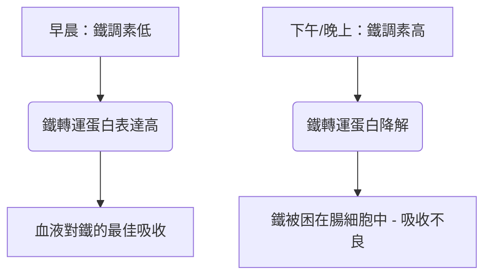

鐵是一種不可或缺的微量營養素，在氧氣運輸、細胞呼吸和 DNA 合成中作為結構和催化輔因子發揮作用。儘管它在自然界中含量豐富，但鐵常常是人類飲食中限制生長的營養素。由於人類沒有主動排泄鐵的生理機制，全身的鐵平衡完全在腸道吸收的層面上維持。

飲食中的鐵主要有兩種形式：**有機（血紅素）鐵**和**無機（非血紅素）鐵**。

血紅素鐵具有極高的生物利用度，通常的吸收率在 15% 到 35% 之間。它通過血紅素載體蛋白 1 (HCP1) 完整地轉運穿過十二指腸腸上皮細胞的頂端刷狀緣，並且不受標準飲食抑制劑的影響。

相反，非血紅素鐵（無機鐵）佔飲食攝入量的 80% 以上，但其吸收狀況卻大打折扣，吸收率僅在 2% 到 20% 之間。

> [!TIP]
> 在生理 pH 值下，非血紅素鐵主要以氧化的高不溶性高鐵 (Fe³⁺) 狀態存在。為了被吸收，它必須在通過二價金屬轉運蛋白 1 (DMT1) 進入腸上皮細胞之前，被頂端還原酶十二指腸細胞色素 b (Dcytb) 還原為可溶性的亞鐵 (Fe²⁺) 狀態。

## 血紅素鐵 vs 非血紅素鐵途徑

| 特徵 / 指標 | 血紅素鐵途徑 | 非血紅素（無機）鐵途徑 |
| :--- | :--- | :--- |
| **飲食來源** | 動物組織（血紅蛋白、肌紅蛋白） | 植物、強化鐵食品、礦物鹽 |
| **頂端轉運蛋白** | 血紅素載體蛋白 1 (HCP1) | 二價金屬轉運蛋白 1 (DMT1) |
| **所需價態** | 卟啉結合絡合物 | 亞鐵 (Fe²⁺) |
| **最佳腸道 pH 值** | 廣泛穩定；不受胃酸影響 | 需要高酸性 (pH < 3.0) 才能溶解 |
| **典型吸收效率**| 15% – 35%（高生物利用度） | 2% – 20%（波動很大） |
| **對飲食抑制劑的敏感性** | 微乎其微；受卟啉環保護 | 極高（受植酸鹽、多酚、鈣抑制） |

## 最佳服用時間（時間藥理學）

優化非血紅素鐵的吸收需要與**鐵調素 (Hepcidin)** 的晝夜節律精確協調。鐵調素主要由肝細胞合成，是一種含有 25 個氨基酸的肽類激素。鐵調素作為全身鐵穩態的主要調節劑，通過直接結合基底外側的鐵轉運蛋白 (Ferroportin) 並誘導其降解來發揮作用。因此，循環中鐵調素水平的升高會將鐵困在十二指腸腸上皮細胞內，阻止其進入血液。

### 鐵調素的晝夜節律
在基礎生理條件下，鐵調素濃度在清晨處於最低點，在整個下午穩步上升至峰值，並在夜間下降。

這種晝夜節律曲線直接影響口服鐵劑的動力學。**早晨服用**鐵劑補充劑可以使礦物質在腸上皮細胞鐵轉運蛋白表達最高時到達十二指腸。相反，在下午或晚上服用會迫使鐵與升高的鐵調素阻斷作用相競爭，導致部分鐵吸收率降低 37%。

### 胃酸的影響
無機鐵的生物物理狀態高度依賴於胃酸的產生。通過質子泵抑制劑（PPI - 胃藥）進行藥理學上的胃酸抑制會嚴重破壞這種微環境，提高胃液 pH 值，並導致可溶性的 Fe²⁺ 迅速氧化為高度不溶性的 Fe³⁺。

> [!WARNING]
> 口服鐵劑必須空腹服用（最好在飯前 1 小時或飯後 2 小時），並且必須嚴格與任何抑制胃酸的藥物分開服用。

## 致命的相互作用（絕對不能混合的物質）

如果在攝入口服鐵劑的同時攝入各種飲食化合物和藥物，其治療效果極易受損。

### 鈣
無論作為膳食奶製品（牛奶、奶酪、酸奶）還是作為礦物質補充劑（碳酸鈣）攝入，鈣都是血紅素和非血紅素鐵吸收的強效抑制劑。在含鐵的膳食中同時攝入 500 毫克碳酸鈣會使部分鐵的吸收減少 50% 以上。

### 單寧和多酚
在**紅茶、綠茶、花草茶和咖啡**中發現的多酚是非常有效的鐵螯合劑。這些植物源性化合物與高鐵配位，形成高度穩定的大型有機金屬絡合物，這些絡合物無法穿過十二指腸刷狀緣。在膳食中僅添加一杯咖啡或茶就能使非血紅素鐵的吸收減少 40% 到 70%。

### 植酸
植酸是全穀物、穀類、堅果和豆類中主要的磷儲存化合物。植酸與鐵的摩爾比是限制植物性飲食中鐵生物利用度的最重要的單一飲食因素。

### 鋅和鎂
亞鐵、鋅和鎂在穿過腸上皮細胞頂端膜（例如 DMT1）時共享重疊的轉運途徑。在治療性鐵劑量下，會發生競爭性抑制，從而顯著抑制鐵的轉運。請勿將您的鐵劑與鋅或鎂同時服用。

### 甲狀腺藥物（左甲狀腺素）
將口服鐵劑與左甲狀腺素（甲狀腺激素）同時服用會導致嚴重的藥物-營養素相互作用。鐵與左甲狀腺素分子配位，形成不溶性絡合物，使左甲狀腺素的口服生物利用度降低 20% 到 64%。

> [!CAUTION]
> 為了防止甲狀腺治療失敗，左甲狀腺素和鐵劑的使用之間必須嚴格保持至少 4 小時的間隔。

## 終極輔因子：維生素C

抗壞血酸（維生素C）是非血紅素鐵吸收的最強促進劑，能夠消除膳食植酸鹽、多酚和鈣的抑制作用。

這種協同關係通過高效的雙重生化機制發揮作用：
1. **熱力學上有利的還原：** 抗壞血酸將不溶性高鐵離子 (Fe³⁺) 快速轉化為高度可溶的亞鐵 (Fe²⁺) 形式，為轉運做好準備。
2. **十二指腸螯合：** 抗壞血酸充當保護盾，防止鐵在過渡到十二指腸的鹼性環境時與植酸鹽和多酚結合。

## 副作用與「隔日服用」範式

治療缺鐵性貧血的傳統方法（每天開大劑量的口服鐵劑）由於嚴重的胃腸道副作用（噁心、便秘）和全身性反饋循環而經常失敗。

由於部分吸收率低，標準口服鐵劑劑量的高達 90% 會未被吸收地留在胃腸道中。這些多餘的鐵與過氧化氫反應生成劇毒的羥基自由基，引發氧化應激和粘膜炎症。

此外，每天高劑量的鐵劑補充會引發全身性的**「粘膜阻滯 (Mucosal Block)」**。攝入 ≥ 60 毫克的口服鐵劑會引起血清鐵調素迅速激增，並在 24 小時內保持較高水平。如果在第二天服用第二劑鐵劑，腸上皮細胞會被物理阻斷，無法將其輸出到門靜脈循環中。鐵被困住，最終被排泄掉。

> [!TIP]
> **隔日服用：** 為了繞過這種由鐵調素介導的阻滯，現代血液學已轉向**隔天（每兩天一次）**口服鐵劑。臨床試驗證明，每 48 小時服用一次鐵劑，其部分鐵吸收率比連續每天服用高出 40% 到 50%，同時大大減少了胃腸道副作用。

### 臨床方案總結

*   **低胃內 pH 值必不可少：** 鐵劑應空腹用白水送服。
*   **避免主要的飲食抑制劑：** 嚴格避免將鐵劑與鈣、奶製品、咖啡或茶同時服用。
*   **保持嚴格的藥物間隔：** 鐵劑和左甲狀腺素至少間隔 4 小時。
*   **利用維生素 C：** 將鐵劑與維生素 C 一起服用可將吸收率提高多達 300%。
*   **採用隔日服用法：** 每隔 48 小時服用口服鐵劑，以避免鐵調素引起的粘膜阻滯並最大化吸收。

## 參考文獻

1. Stoffel NU, Zeder C, Brittenham GM, Moretti D, Zimmermann MB. [Iron absorption from oral iron supplements given on consecutive versus alternate days and as single morning doses versus twice-daily split dosing in iron-depleted women: two open-label, randomised controlled trials](https://pubmed.ncbi.nlm.nih.gov/29032957/). *Lancet Haematol.* 2017.
2. Campbell NR, Hasinoff BB. [Ferrous sulfate reduces thyroxine efficacy in patients with hypothyroidism](https://pubmed.ncbi.nlm.nih.gov/1443969/). *Ann Intern Med.* 1992.
3. Hallberg L, Hulthén L. [Effect of ascorbic acid intake on nonheme-iron absorption from a complete diet](https://pubmed.ncbi.nlm.nih.gov/11124756/). *Am J Clin Nutr.* 2000.
4. Lönnerdal B. [Calcium and iron absorption—mechanisms and public health relevance](https://pubmed.ncbi.nlm.nih.gov/21462112/). *Int J Vitam Nutr Res.* 2010.

本文僅供資訊參考，不構成醫療建議。在調整您的補充劑或藥物治療方案之前，請諮詢合格的醫療專業人員。
